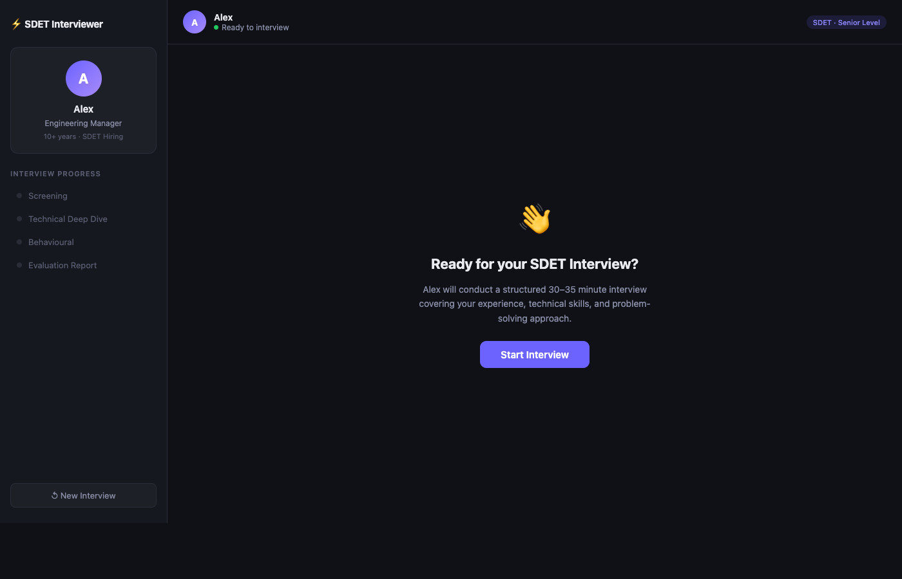

# SDET Hiring Bot

An AI-powered mock interview tool that simulates a structured SDET interview with **Alex**, a Senior Engineering Manager persona powered by Claude Sonnet.



## Features

- **3-phase structured interview** — Screening → Technical Deep Dive → Behavioural
- **Adaptive questioning** — Alex probes deeper on shallow answers and adapts difficulty to seniority
- **Real-time streaming** — responses stream token-by-token like a real chat
- **Scored evaluation report** — at the end, Alex outputs a full report with scores across 8 dimensions, a hiring decision, and suggested follow-up areas
- **Phase tracker** — sidebar shows which phase you're in live

## Tech Stack

- **Backend**: Node.js + Express, Anthropic SDK (`claude-sonnet-4-6`), SSE streaming
- **Frontend**: Vanilla JS, HTML, CSS — no frameworks

## Getting Started

### Prerequisites

- Node.js 18+
- An [Anthropic API key](https://console.anthropic.com/)

### Setup

```bash
git clone https://github.com/prajesh-gupta/sdet-hiring-bot.git
cd sdet-hiring-bot
npm install
```

Copy the example env file and add your key:

```bash
cp .env.example .env
# edit .env and set ANTHROPIC_API_KEY=sk-ant-api03-...
```

### Run

```bash
# Development (auto-reload)
npm run dev

# Production
npm start
```

Open **http://localhost:3000** and click **Start Interview**.

## Evaluation Report

After the interview concludes, Alex generates a scored report covering:

| Dimension | Score |
|---|---|
| Test Design & Strategy | /5 |
| Automation & Tooling | /5 |
| API / Backend Testing | /5 |
| CI/CD & Infrastructure | /5 |
| Mobile Testing | /5 |
| Debugging & Problem Solving | /5 |
| Communication & Clarity | /5 |
| Behavioural / Ownership | /5 |

Along with an overall score, recommended level (Junior → Staff SDET), and a hiring decision (Strong Yes / Yes / Maybe / No).
